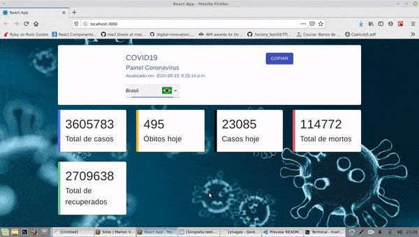

  

# Covid-19 Tracker

## Digital Innovation One

Ferramenta de visualização do numeros da Covid-19
npm
**Fonte: [https://digitalinnovation.one/](https://digitalinnovation.one/)**

### recursos aprendidos:

- React
- Hooks
- Styled-components
- Componentização e estrutura de pastas
- Deploy Netlify

## Consumo das API's:

Dados Covid-19:
[https://coronavirus-19-api.herokuapp.com/countries](https://coronavirus-19-api.herokuapp.com/countries)

Api para as bandeiras:
[https://www.countryflags.io/](https://www.countryflags.io/)

# Como instalar

Clone ou baixe o repositório, acesse a pasta do projeto via terminal e
execute o comando:

`Ỳarn install`
ou
`npm install`

### Pacotes utilizados:

- Material-UI
- Styled-components
- customize-cra
- react-app-rewired

